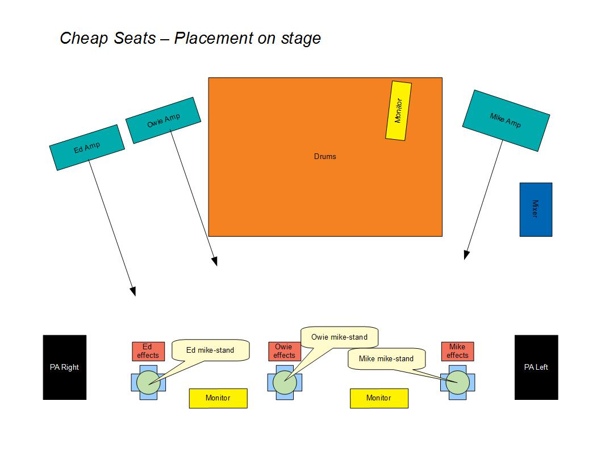

Best Practise
=============

What stage?
-----------

In the case of a venue that lacks a proper stage area, where the band is going to be placed is often the last thing on the club owner / manager's mind. This means you might find yourself in an unsatisfactory situation - pre-empt this as much as possible by visiting the venue and finding the best possible place to play.

You do need to know the absolute minimum floor area you require for a setup [when you're all on stage and nobody is being side-swiped by the person next to them]. If you find that the area allocated to the band is too small, then discuss the problem with the manager / owner. Given a logical argument they will usually agree with your requests.

For a quick setup you have to make sure that everyone has clear access to their part of the stage.

.. note::

	Keep the stage as clear as possible at all times. Once you've set an item up, move everything you don't need off the stage.

Here is a representation of our basic layout:

Drums first
-----------

Get all the kit gear onto the stage, as close as possible to the drummer's space - the rostrum if you're lucky enough to have one. This may take up space required by the guitarist/s at first.

PA second
---------

Place the speakers up front and the mixing desk on stage, as close to the operator as possible. Run all the required cables and plug in. At this time the guitarists should be running power cables from the outlets to where their amp and effects are to be situated. The floor monitors should be placed and power cables set up for them.

Guitar amps third
-----------------

Once the drummer's gear is out of the way the guitarists move their amps onto the stage and start plugging in their amps and wiring up their effects. Once complete they can start setting up their mike stands and running cables to the mixer. The drummer should also be wiring up his mikes at this time.

.. note::

	The drummer should be able to hear the bass at all times!

	
Monitors and mikes last
-----------------------

Plug in the power to the monitors and run audio cabling to the desk. At this point you should be ready for line checks.

