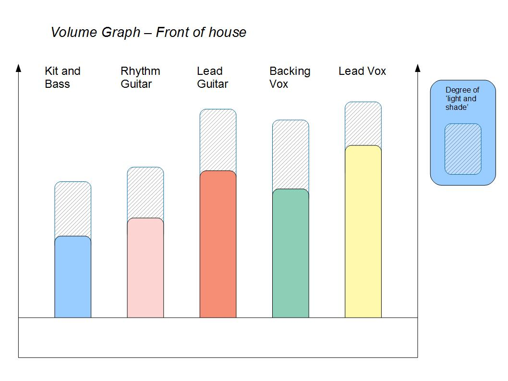

Phase III
*********

The Sound Check
===============

Okay, so we've finally reached the place where:

	- everything is in it's place on stage
	- all the lights are on
	- all instruments and vocals and kit mikes are coming through the system
	- all the vocals are present in the monitors
	- all bags, cases, boxes etc. have been cleared off stage and we can move around without falling all over the place

It's time for the sound check.

Pick an easy song to play - one where everyone has a go ie. all the vox are used, and the guitarists play a solo each. Someone should be out front to listen to the overall sound. Use this diagram as a basis for the balancing of the various instruments:

The relationships depicted should be held to as a general rule of thumb. You will find if you deviate too far from this arrangement that the whole foh sound goes out of whack.

Play enough of the song to get an idea whether:

	- the stage volume is not too loud, and
	- everyone can hear the vocals

Adjust the monitors accordingly, bearing in mind that a too-loud stage volume will badly upset the balance on the PA. In other words: Try to keep the stage volume down by turning guitars down instead of turning the monitors up.

Things to keep in mind
----------------------

Your ears will take at least 5 minutes to acclimatise to the general sound level. What this means practically is: play through two or three songs after the initial stoppage - playing the whole song is unnecessary - just do the intro and two verses with solos. Check with everyone after each song. You will find that the problems usually iron themselves out.

Kit
---
.. note::

	If playing in a corner [as sometimes happens] and the kit sound is bouncing around [messy], try to pad the area around the kit with speaker covers, guitar cases etc. This can make a huge difference to the overall stage sound.

The drummer should *never* have to bash the kit in order to hear himself. If this is the case then **turn the guitars down**!

The vocals
----------

Some questions:

	- Can the lead singer hear themselves in the PA?
	- Can the backing singers hear themselves in the PA?

If the answer to both these questions is 'no', then the next question to ask is:

	- Are the vocals loud enough in the PA?

If the answer is 'yes', then the stage volume is *too loud*. **Turn the guitar amps down**!

If you're one of the guitarists who sings backing and you find that you can't hear your voice but can hear the lead vocal then **turn your amp down**.

The guitars
-----------

Both guitars must be heard at all times. This often requires a balancing act, but the process is not as complicated as it seems.

#. The guitarists should not be playing the same chord inversions and / or rhythm patterns
#. If they are duplicating either the inversions or patterns they must be perfectly synchronised
#. No guitar should be louder than the other

Lead volume should be up at the same level as the lead vocal, **however**, at the end of a solo the guitar volume *must* return to where it was previously, otherwise *volume creep* happens! While this may feel great to the guitarists, it most certainly makes things harder for everyone else.

The rhythm section [kit and bass guitar]
----------------------------------------

This is the heart of the live sound. If there is something off kilter with either the kit or the bass volume it will throw the whole FOH mix. They have to mesh together on every level. That is to say:

	- The kick drum and bass guitar must both be heard equally loudly. The one *cannot* be allowed to overpower the other. Balance the volumes.
	- Nothing is more disconcerting to a front-line musician / singer than a rhythm section that is pulling in all directions at once. The players *must* play as one.
	- Their overall volume cannot overpower the other instruments in the mix.

