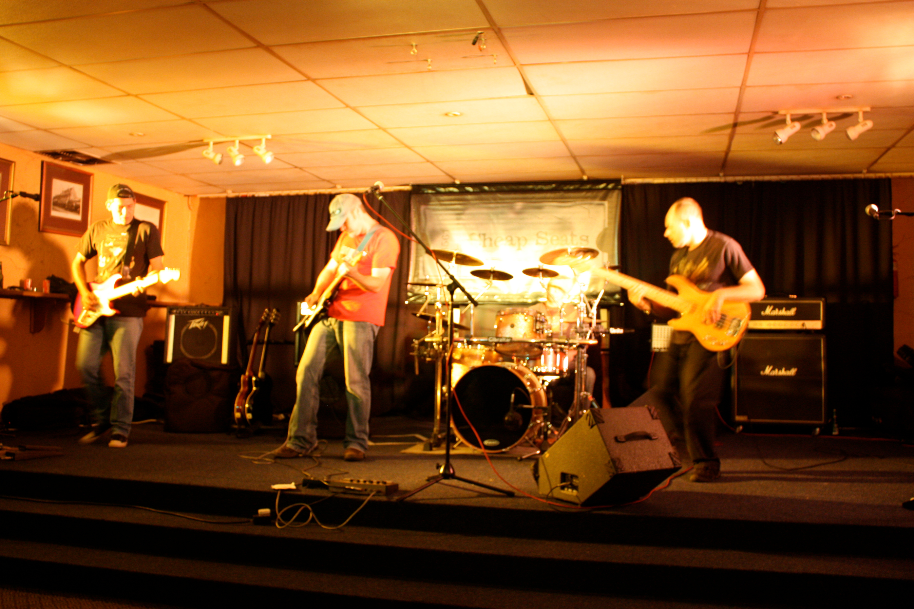
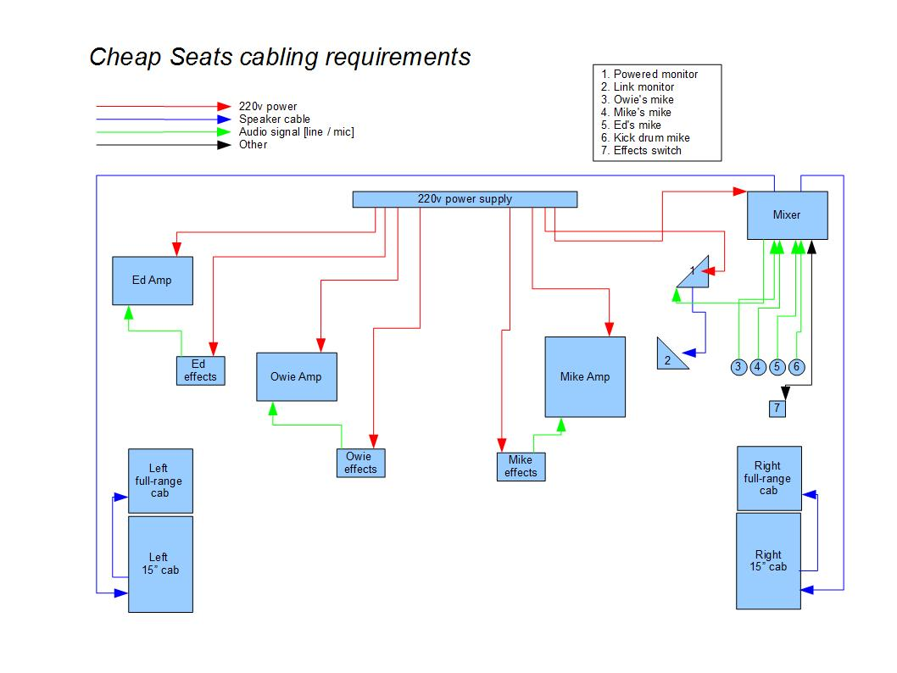

The Cheap Seats
***************

Thoughout this manual I will use the band 'The Cheap Seats' as an example for us to consider. This is [was] an actual band I played in [see https://www.youtube.com/watch?v=u0ZI4sF6OP0] and will serve as a standard model for the application of ideas / processes I propose.

As you can see the line-up is straight-forward: two guitars, bass guitar, drums, and everyone has a mike.

Our cabling requirements for the stage setup can be depicted as follows:

